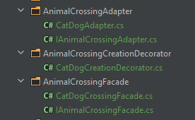
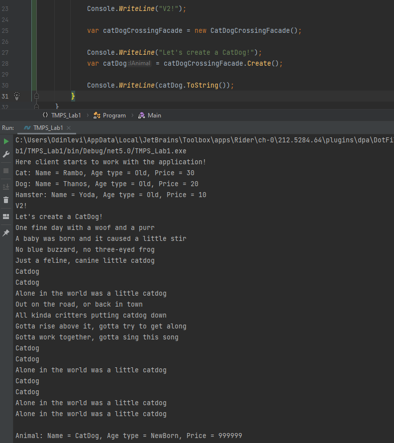

# TMPS Lab1 and Lab2

## Author: `Nichiforov Maxim`
## Topic: `Animal Shelter`

## Introduction:
In this laboratory work I decided to create an animal shelter.
Clients gonna choose the animals by the type and the age of the animal.
Is it an old hamster? Or a newborn cat? Only client will decide.

## Implementation/Explanation:
### Lab 1
To start the project, you gonna need any environment that supports C#.
No libs nor dependencies where added to the project so simple Visual Studio
will do.

For this laboratory work I've decided to use 3 creational design patterns:
1) Factory. We will have newborn animals, young animals and old animals.
   Then they also will be divided into cats, dogs and hamsters.

2) Builder. We will use it to "choose" (create) an animal.
   The idea here is to differentiate animals by their age. Depending of the age
   the price of the animal will be different.

   Director class will take care of organization.

3) Singleton. We want our factories to exist in single exemplar.

For client to finally choose the animal he needs to:
    1) Create the factory (which age do you want?)
    2) Choose the animal type
    
### Lab 2
This laboratory work was about using structural design patterns. Along with
rechecking the material about the those patterns I was wondering how will I
connect animal shelter idea with them. And the only thing that came to my
mind was to repeat the idea of Dr. Moro. I decided to cross the animals!

This time I've used 3 constructional design patterns:
1) Adapter. We need a new animal that actually is two animals crossed together.
   We never had such an opportunity nor the functionality so there should be
   something that will take two different objects and make them one. `Cross` them!

2) Decorator. Well, we can 'Cross' to things. But what if I dont want to bother by
   creating two animals and then crossing them together. I just want a result in
   one row. And the decorator will continue the idea of adapter. Let's `Create`
   a new animal! 
3) Facade. If I don't want to have anything in common with crossing, I just want
   to see the result, I'll hide the `Cross` method behind the facade!

## Conclusion
The idea behind patterns I've used became a bit clearer for me after I've
used them in practice. I can admit that some of them are very important for
some situations. The main issue for me in this work was to get in pace with
all the abstractions I've had to maintain, sometimes it was getting a bit
tricky.
